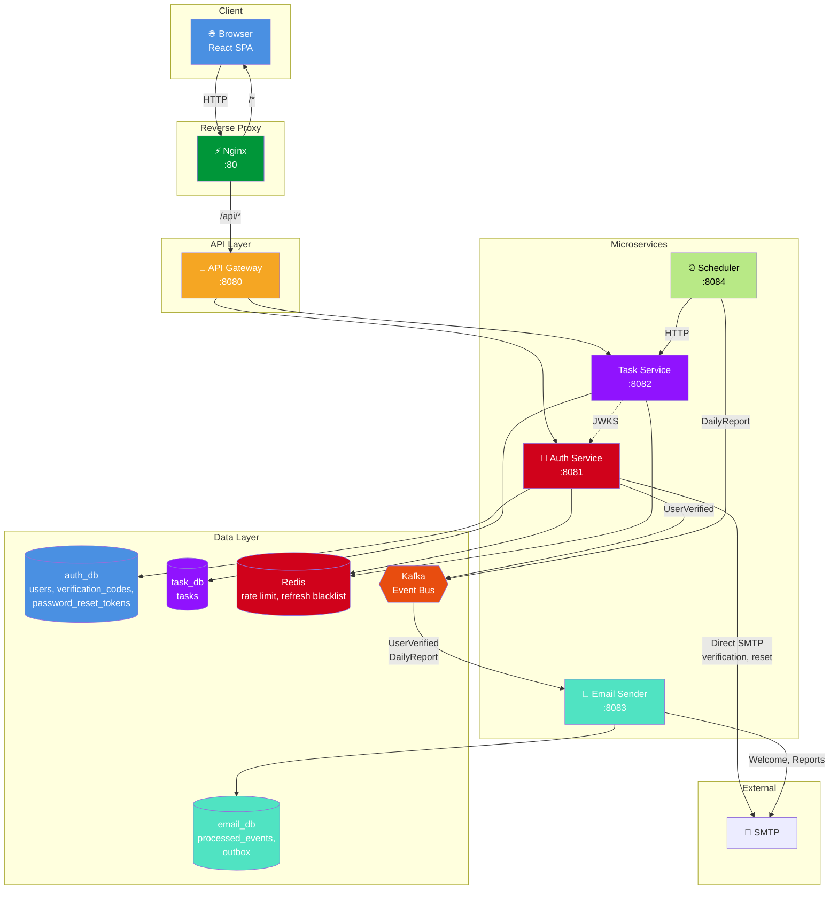
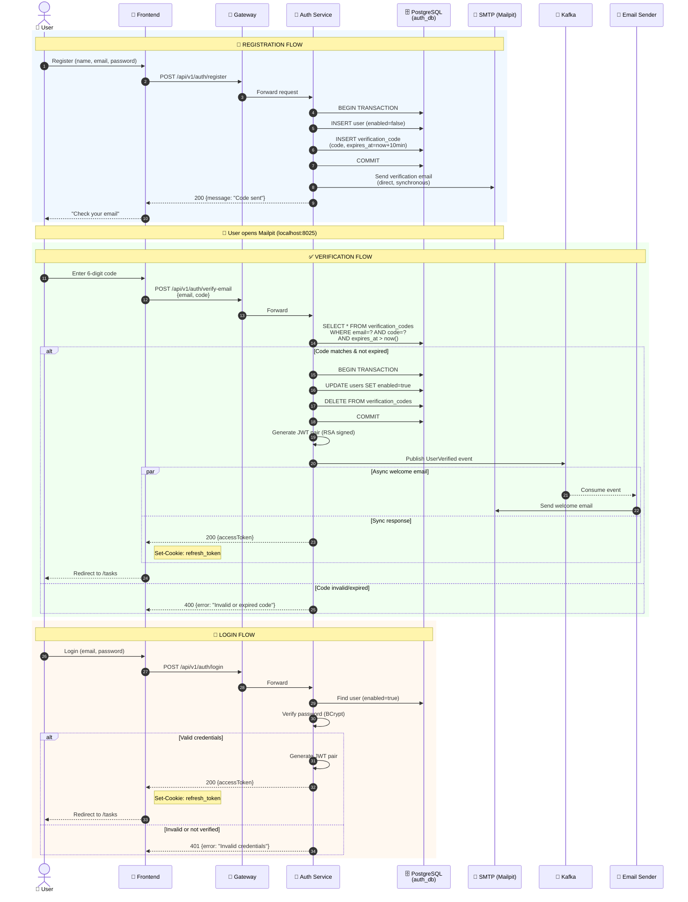
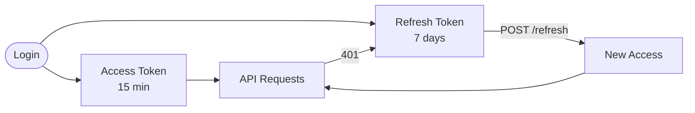
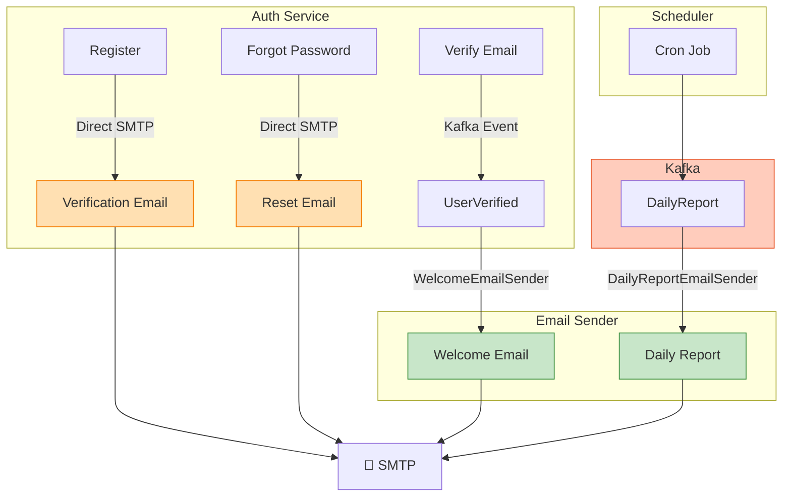

# 📋 ToDo App — Microservices Task Management Application

A full-featured task management application built with microservices architecture, JWT authentication, event-driven communication via Kafka, and automated CI/CD.


## 🧱 Built with

[](https://java.com/)
[](https://spring.io/projects/spring-boot)
[](https://hibernate.org/)
[](https://www.postgresql.org/)
[](https://www.liquibase.org/)
[](https://www.docker.com/)
[](https://redis.io/)
[](https://www.testcontainers.org/)
[](https://junit.org/junit5/)
[](https://site.mockito.org/)
[](https://react.dev/)

[](https://kafka.apache.org/)
---

## 🎯 Key Features

### User-Facing
- ✅ Registration and login with email + password
- 🔐 Email verification via 6-digit code
- 🔄 Password recovery via email link
- 🌐 OAuth2 with Google (optional)
- 📝 Full CRUD operations for tasks
- 📧 Daily task reports sent by email
- 🛡️ Rate limiting on critical endpoints

### Technical
- 🔑 JWT with RSA signature (access + refresh tokens)
- 🍪 HttpOnly cookies for refresh tokens (XSS protection)
- 📮 Outbox Pattern for reliable event delivery
- 📨 Kafka for asynchronous inter-service communication
- 🗄️ 3 independent PostgreSQL databases
- ⚡ Redis for rate limiting and caching
- 🐳 Full containerization
- 🚀 CI/CD via GitHub Actions → Docker Hub → VPS

## 🏗️ Architecture




### Authentication Flow



### Token Lifecycle


### Email Sending Architecture



**Legend:**
- 🟧 **Orange** = Synchronous (auth-service → SMTP directly)
- 🟩 **Green** = Asynchronous (Kafka → email-sender → SMTP)

### Microservices

| Service | Port | Purpose |
|---------|------|---------|
| **api-gateway** | 8080 | Routing, JWT validation, CORS |
| **auth-service** | 8081 | Authentication, JWT, OAuth2, email verification |
| **task-service** | 8082 | Task CRUD, business logic |
| **email-sender** | 8083 | Email delivery (welcome, verification, reports) |
| **scheduler** | 8084 | Cron jobs (daily reports) |
| **frontend** | 80 | React SPA served via Nginx |

---

## 🚀 Quick Start

### Prerequisites

- **JDK 26** (Temurin recommended)
- **Docker** + Docker Compose v2
- **Node.js 20+** and npm
- **IntelliJ IDEA** (recommended, for hot reload)

### 1. Clone the Repository

```bash
git clone https://github.com/your-username/todo-app.git
cd todo-app
```

### 2. Configure Environment Variables
```bash
cp .env.example .env
nano .env  # Fill in the secrets
```

#### Generate Key Secrets:

```bash
# RSA keys for JWT
openssl genrsa -out private.pem 2048
openssl rsa -in private.pem -pubout -out public.pem
base64 -w0 private.pem > private.b64
base64 -w0 public.pem > public.b64

# INTERNAL_API_KEY (for scheduler ↔ task-service communication)
openssl rand -hex 32

# REDIS_PASSWORD
openssl rand -base64 24
```

### 3. Start Infrastructure(Docker)
```bash
docker compose -f docker-compose-local.yml up -d
```
#### What starts:
- **✅**: PostgresSQL (3 instances: auth,task,email)
- **✅**: Redis
- **✅**: Kafka
- **✅**: Mailpit (for mail testing, UI: http://localhost:8025

### 4. Start Backed from IDEA
Open project in intellij IDEA and start sevices in this order:
1. auth-service (port - 8081)
2. api-gateway (port - 8080)
3. task-service (port - 8082)
4. email-sender (port 8083)
5. scheduler (port 8084)

> [!TIP]
> Use the **[EnvFile](https://plugins.jetbrains.com/plugin/7861-envfile)** plugin in IntelliJ IDEA to automatically load `.env` variables into each Run Configuration.

### 5. Start Frontend
```bash
cd frontend
npm install
npm run dev
```

### 6. Open the Application
- **🌐**: Application http://localhost:5173
- **📧**: Mailpit(email UI): http://localhost:8025
- **📊 **: http://localhost8085 (if started with profile monitoring)

### 📂 Project Structure
```text
todo-app/
│
├── 📦 auth-service/                    # Authentication & JWT service
│   ├── src/main/java/
│   │   └── ru/pancomanco/authservice/
│   │       ├── config/                 # Security, RSA, Kafka configs
│   │       ├── controller/             # REST endpoints
│   │       ├── entity/                 # JPA entities
│   │       ├── messaging/              # Outbox + Kafka publisher
│   │       ├── security/               # JWT filters, OAuth2 handlers
│   │       └── service/                # Business logic
│   ├── src/main/resources/
│   │   ├── application.yml             # Base config
│   │   └── messages.properties         # i18n messages
│   └── 🐳 Dockerfile                   # Container image build
│
├── 📦 task-service/                    # Tasks CRUD service
│   ├── src/main/java/
│   │   └── ru/pancomanco/taskservice/
│   ├── src/main/resources/
│   │   ├── application.yml
│   │   └── messages.properties
│   └── 🐳 Dockerfile
│
├── 📦 api-gateway/                     # Spring Cloud Gateway
│   ├── src/main/java/
│   │   └── ru/pancomanco/apigateway/
│   │       └── config/                 # Security, CORS, Routes
│   ├── src/main/resources/
│   │   ├── application.yml
│   └── 🐳 Dockerfile
│
├── 📦 email-sender/                    # Kafka consumer → SMTP
│   ├── src/main/java/
│   │   └── ru/pancomanco/emailsender/
│   │       ├── consumer/               # Kafka listeners
│   │       └── service/                # Email senders
│   ├── src/main/resources/
│   │   ├── application.yml
│   │   └── messages.properties
│   └── 🐳 Dockerfile
│
├── 📦 scheduler/                       # Cron jobs (daily reports)
│   ├── src/main/java/
│   │   └── ru/pancomanco/scheduler/
│   │       └── job/                    # DailyReportJob
│   ├── src/main/resources/
│   │   └── application.yml
│   └── 🐳 Dockerfile
│
├── 🧩 common/                          # Shared library
│   └── src/main/java/ru/pancomanco/common/
│       ├── i18n/MessageService.java    # i18n helper
│
├── 🎨 frontend/                        # React SPA
│   ├── src/
│   │   ├── components/                 # AuthScreen, TasksScreen
│   │   └── api.js                      # API client
│   ├── public/
│   ├── 🐳 Dockerfile                   # Nginx + static build
│   ├── nginx.conf                      # Production nginx config
│   ├── vite.config.js
│   └── package.json
│
│
├── 🔧 docker-compose-local.yml         # Local infrastructure
├── 🚀 docker-compose-prod.yml          # Production compose
├── 📜 deploy.sh                        # VPS deployment script
│
├── ⚙️ .github/workflows/
│   └── ci-cd.yml                       # GitHub Actions pipeline
│
├── 🔐 .env.example                     # Variables template
├── 📄 .gitignore
├── 📖 README.md
├── 🏗️ build.gradle                     # Root build config
└── ⚙️ settings.gradle                  # Multi-module config
```

### Authentication
#### Flow 
```text
1. POST /api/v1/auth/register
   ↓ verification code sent to email
2. POST /api/v1/auth/verify-email
   ↓ access_token returned + refresh_token in httpOnly cookie
3. GET /api/v1/tasks (with Authorization: Bearer <access_token>)
   ↓ on 401 — automatic refresh
4. POST /api/v1/auth/refresh (cookie sent automatically)
   ↓ new access_token + refresh_token rotation
5. POST /api/v1/auth/logout
   ↓ cookie removed
```
#### Tokens

| Token | Storage | TTL | Purpose |
|-------|---------|-----|---------|
| Access Token | `localStorage` | 15 min | API authorization (`Bearer` header) |
| Refresh Token | `httpOnly` cookie | 7 days | Silent token renewal |

#### Security:
- **✅**: RSA-signed JWT (2048 bit)
- **✅**: HttpOnly cookie for refresh (XSS protection)
- **✅**: SameSite=None + Secure for production
- **✅**: Rate limiting (Bucket4j) on login/register
- **✅**: Reuse detection: if refresh token is used twice — all sessions are terminated


### 📮 Outbox Pattern
For guaranteed event delivery (user verified, daily report), **Transactional Outbox** is used:
```text
1. Business operation + INSERT into outbox table (single transaction)
2. OutboxPoller reads unpublished events every 5 seconds
3. Publish to Kafka
4. On success — mark as published
5. On failure — exponential backoff (up to 10 attempts)
6. After 10 failures — marked as "dead" (requires manual intervention)
```
**Guarantees:**
- **✅**: No event loss (events persist even if Kafka is down)
- **✅**: At-least-once delivery (consumer must be idempotent)
- **✅**: Automatic retries

### 🌍 Internationalization (i18n)
All user-facing messages are extracted to messages.properties:
```text
auth-service/src/main/resources/messages.properties    # Auth messages
task-service/src/main/resources/messages.properties    # Task errors
email-sender/src/main/resources/messages.properties    # Email templates
```
Supported languages: **Russian**, **English** (via messages_en.properties). You can change localisation adding Header Accept-Language: ru

### 🧪 Testing
#### Unit Test
```bash
./gradlew test
```

#### Integration Tests (Testcontainers)
```bash
./gradlew :auth-service:integrationTest
```

#### API Tests (curl)
```bash
# Register
curl -X POST http://localhost:8080/api/v1/auth/register \
  -H "Content-Type: application/json" \
  -d '{"name":"John","email":"john@example.com","password":"Password123!"}'

# Verify email (code from Mailpit)
curl -X POST http://localhost:8080/api/v1/auth/verify-email \
  -H "Content-Type: application/json" \
  -d '{"email":"john@example.com","code":"123456"}'

# Create task
curl -X POST http://localhost:8080/api/v1/tasks \
  -H "Authorization: Bearer <access_token>" \
  -H "Content-Type: application/json" \
  -d '{"title":"Buy milk","description":"2 liters"}'
```
### 📊 Monitoring
Optional stack (monitoring profile):
```bash
docker compose -f docker-compose-local.yml --profile monitoring up -d
```
- **Prometheus**: http://localhost:9090
- **Grafana**: http://localhost:3000 (admin/admin)
- **Kafka UI**:  http://localhost:8085

#### Key Metrics
- **http_server_requests_seconds** - endpoint latency
- **outbox_publish_errors_total** - Kafka publish errors
- **outbox_dead_letters_total** - events failed after 10 attempts
- **bucket4j_rate_limit_rejected** -  requests blocked by rate limiter
- **jvm_memory_used_bytes** - memory usage
- **email_sent** - Number of emails successfully sent
- **emails_duplicates_skipped** - number of emails duplicates skipped

### 🛠️ Useful Commands
**Docker**
```bash
# Start infrastructure
docker compose -f docker-compose-local.yml up -d

# View service logs
docker logs -f auth-service

# Restart single service
docker compose -f docker-compose-local.yml restart redis

# Full cleanup (with volume deletion!)
docker compose -f docker-compose-local.yml down -v

# Connect to DB
docker exec -it auth-postgres psql -U authuser -d auth_db
```
**Gradle**
```bash
# Build all modules
./gradlew build

# Build specific service
./gradlew :auth-service:build

# Run tests
./gradlew test

# Clean cache
./gradlew clean
```
**Frontend**
```bash
cd frontend

# Install dependencies
npm install

# Dev mode with HMR
npm run dev

# Production build
npm run build

# Linting
npm run lint
```
### 📚 Main API Endpoints
**Auth (/api/v1/auth)**

| Method | Endpoint | Auth | Description |
|:------:|----------|:----:|-------------|
| `POST` | `/register` | ❌ | Register new user (sends verification email) |
| `POST` | `/verify-email` | ❌ | Verify email with 6-digit code → returns tokens |
| `POST` | `/resend-verification-code` | ❌ | Resend verification code |
| `POST` | `/login` | ❌ | Login → access token + refresh cookie |
| `POST` | `/refresh` | 🍪 | Refresh access token using cookie |
| `POST` | `/logout` | 🍪 | Logout → blacklist refresh token |
| `POST` | `/forgot-password` | ❌ | Request password reset link |
| `POST` | `/reset-password` | ❌ | Reset password using token from email |

### 📝 Tasks (`/api/v1/tasks`)

| Method | Endpoint | Auth | Description |
|:------:|----------|:----:|-------------|
| `GET` | `/` | 🔑 | List current user's tasks |
| `GET` | `/{id}` | 🔑 | Get task by ID (must be owned by user) |
| `POST` | `/` | 🔑 | Create new task |
| `PUT` | `/{id}` | 🔑 | Update task title & description |
| `PATCH` | `/{id}/complete` | 🔑 | Mark task as completed |
| `PATCH` | `/{id}/incomplete` | 🔑 | Mark task as incomplete |
| `DELETE` | `/{id}` | 🔑 | Delete task |

**Legend:**
- ❌ No authentication required
- 🍪 Requires `refresh_token` cookie (sent automatically)
- 🔑 Requires `Authorization: Bearer <access_token>` header

**POST /api/v1/auth/register**
```json
// Request
{
  "name": "John Doe",
  "email": "john@example.com",
  "password": "SecurePass123!"
}

// Response 200
{
  "message": "Verification code sent to email"
}
```
**POST /api/v1/auth/login**
```json
// Request
{
  "email": "john@example.com",
  "password": "SecurePass123!"
}

// Response 200
{
  "accessToken": "eyJhbGciOiJSUzI1NiJ9..."
}
// + Set-Cookie: refresh_token=eyJ...; HttpOnly; Path=/api/v1/auth
```
**POST /api/v1/tasks**
```json
// Request (requires Bearer token)
{
  "title": "Buy groceries",
  "description": "Milk, bread, eggs"
}

// Response 200
{
  "id": 1,
  "title": "Buy groceries",
  "description": "Milk, bread, eggs",
  "completed": false,
  "createdAt": "2026-01-21T10:30:00Z",
  "updatedAt": "2026-01-21T10:30:00Z"
}
```

**GET /api/v1/tasks**
```json
// Response 200
[
  {
    "id": 1,
    "title": "Buy groceries",
    "description": "Milk, bread, eggs",
    "completed": false,
    "createdAt": "2026-01-21T10:30:00Z"
  },
  {
    "id": 2,
    "title": "Write README",
    "description": null,
    "completed": true,
    "createdAt": "2026-01-21T11:00:00Z"
  }
]
```
## 🎓 Acknowledgments

This project was built as the **final (7th) project** of the [Java Backend Learning Course](https://zhukovsd.github.io/java-backend-learning-course/) by [Sergei Zhukov](https://github.com/zhukovsd).

The roadmap covers the complete path from beginner to Junior Java Backend Developer through 7 progressively complex projects. This microservices application demonstrates mastery of the following topics from the roadmap:

- ☕ **Java & Spring Boot** — REST APIs, security, validation
- 🗄️ **Databases** — PostgreSQL, Redis, JPA/Hibernate
- 📨 **Message brokers** — Apache Kafka, Outbox Pattern
- 🐳 **Containers & Microservices** — Docker, Spring Cloud Gateway
- 🔐 **Security** — JWT, OAuth2, rate limiting
- 🚀 **DevOps** — CI/CD with GitHub Actions, VPS deployment
- 🧪 **Testing** — JUnit, Testcontainers, integration tests

### 🙏 Special thanks to

- **[Sergei Zhukov](https://github.com/zhukovsd)** — for the amazing free roadmap and detailed project reviews
- **[Community chat](https://t.me/zhukovsd_it_chat)** — for support and knowledge sharing with fellow students
- **[Public code reviews](https://www.youtube.com/playlist?list=PL4ptOh0kYGE8GheUOooxVfR4k8aYkI9dX)** — for learning from real project reviews
